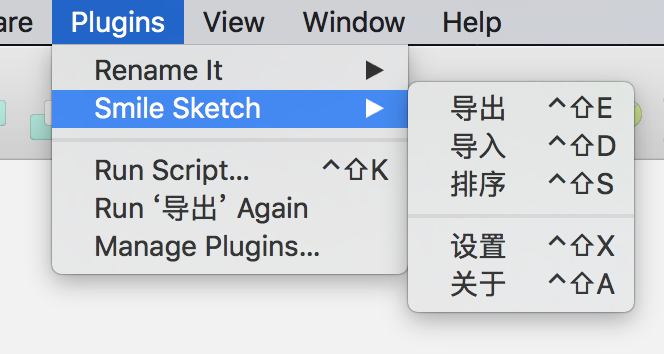
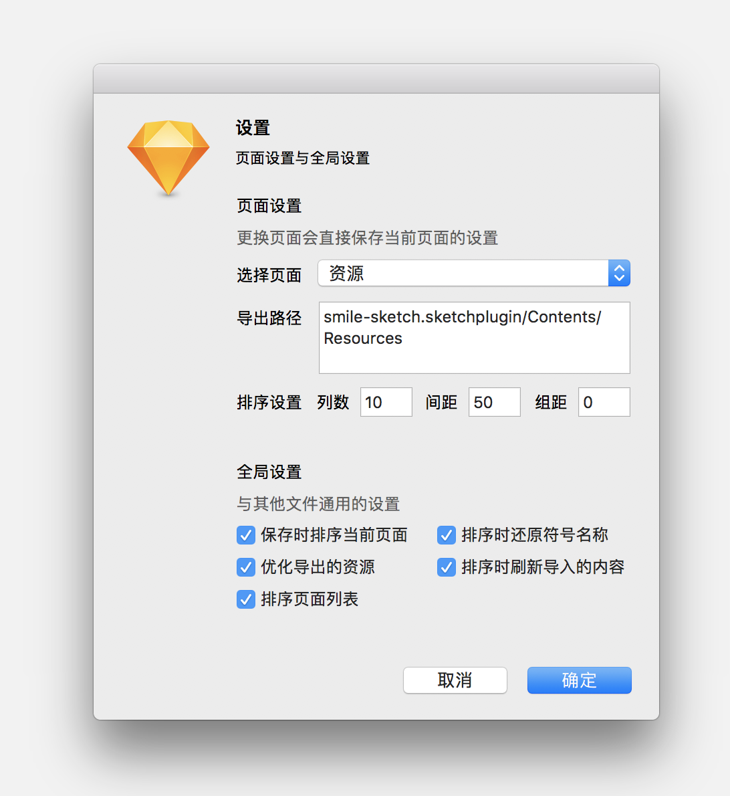

# Smile Sketch

文档快速整理排序，资源导入与导出

## 预览图

## 更新说明

1.2.0
- 优化代码逻辑结构
- 增加设计界面与关于界面
- 修复诸多Bug
- 清理无用内容

1.1.0
- 清理了一些无用的功能
- 保存文件时排序当前页面画板
- 导出可以正确的导出所有切片了
- 导出附加压缩图片功能（无损）
    - 附加一个压缩程序在插件内部（主要处理 jpg png, svg 需要全局安装 [Svgo](https://github.com/svg/svgo)）
- 插件编译器
    - 重构

1.0.0
- 发布
