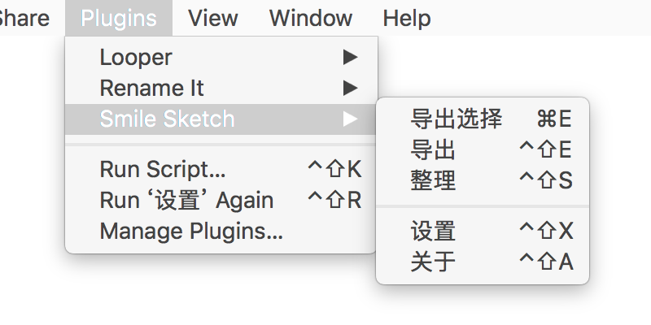
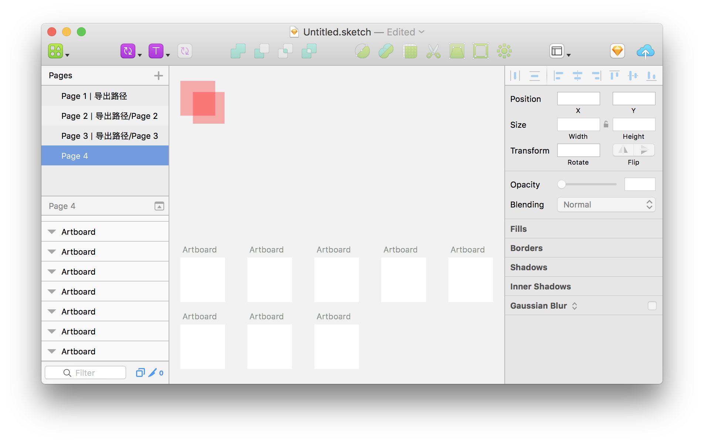
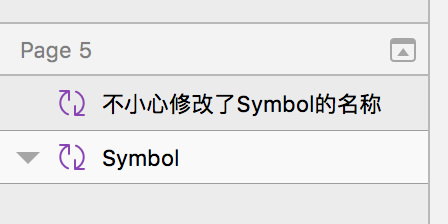
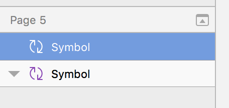
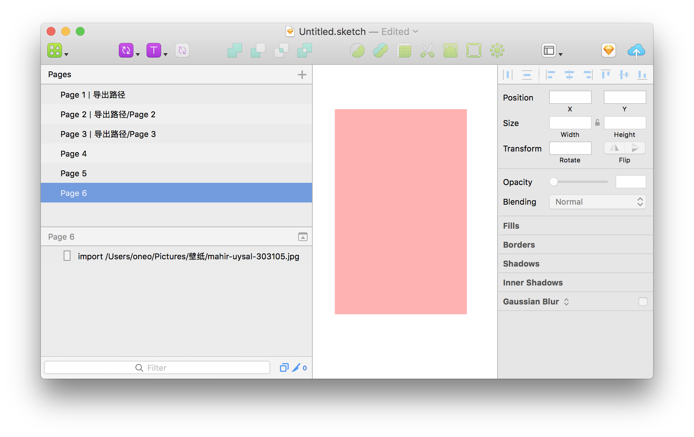
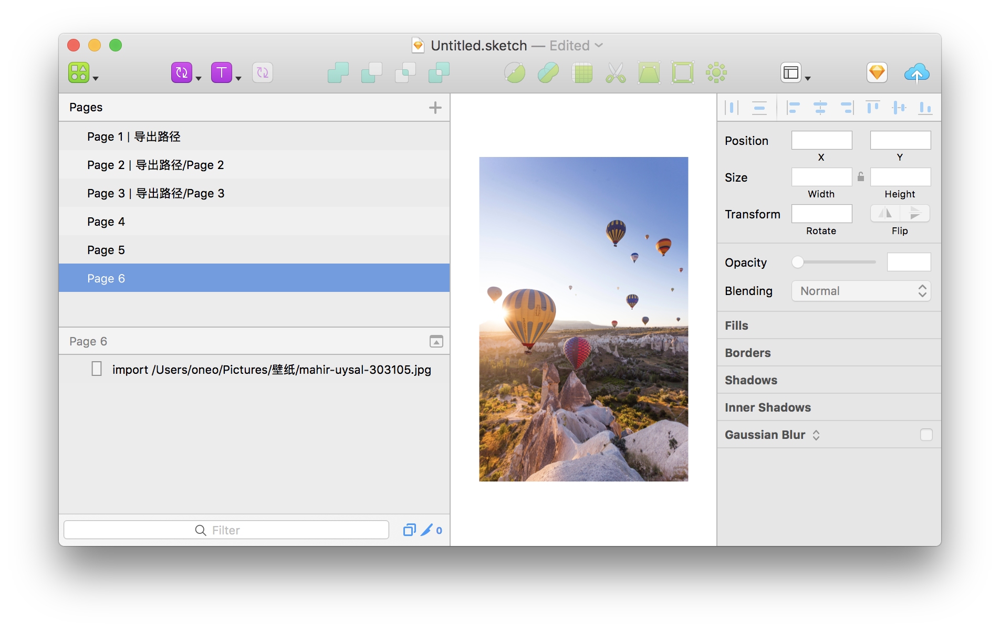
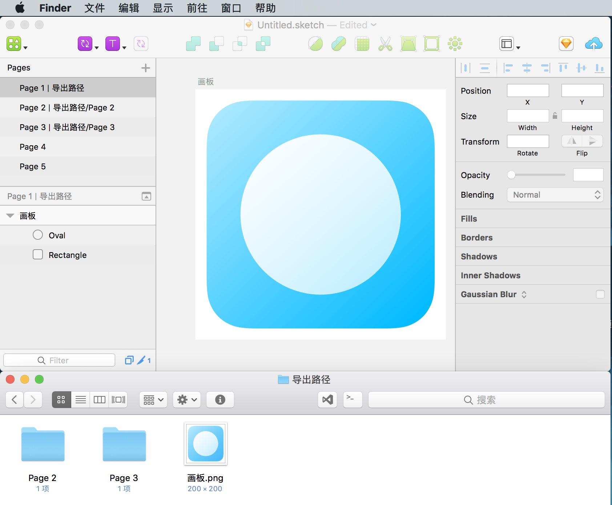

# 

## 预览

### 菜单

### 设置

Control Shift X 打开设置界面

## 下载

- [下载插件](https://github.com/1217950746/Smile-Sketch/archive/master.zip) 并解压缩
- 打开 **smile-sketch.sketchplugin** 安装插件

## 功能

### 整理页面列表、图层列表、页面内容

如上图，按下快捷键 Control Shift S 即可整理为以下效果

### 还原符号名称

> 需要在设置中开启，会在整理时自动执行

插件会修改符号名称到最原始的符号名称

如果不需要插件修改这个名称可以把子符号命名为“@ Symbol”这种名称，也就是前边写上“@ ”

### 导入内容

> 会在整理时执行导入

目前可以导入文本内容与位图

图层命名为“import 文件路径”，就可以到如内容到图层

### 导出内容

导出全部：Control Shift E

导出选择：没有快捷键，可以在系统键盘设置中自定义一个

- 插件会导出所有切图
- 插件也会导出命名为“export 路径”的文本图层
- 未保存的设计文件导出路径为桌面
- 已保存的设计文件导出路径为设计文件所在目录
- 可以在设置界面自定义每个页面的导出路径