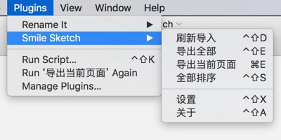
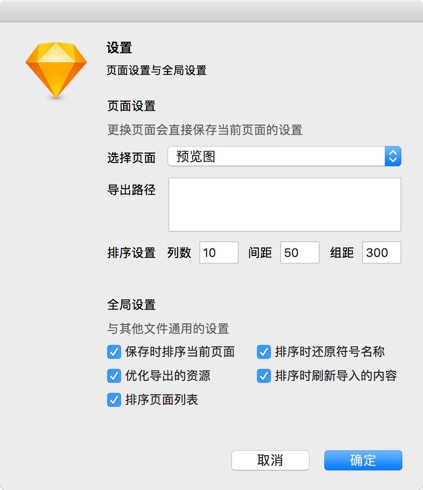

> 我自己在使用 Sketch 过程中遇到的一系列问题或是不方便的地方，我没有找到合适插件的情况下开发了这个插件。

- 快速导入外部位图或文本到设计稿，外部文件变更的情况下自动刷新
- 快速导出所有切片和指定文本到指定目录
- 页面排序，图层排序，画板排序，还你一个整洁的设计稿

## 下载
- [下载插件](https://github.com/1217950746/Smile-Sketch/archive/master.zip) 并解压缩
- 打开 **smile-sketch.sketchplugin** 安装插件

## 预览

**菜单栏**

**设置界面**

